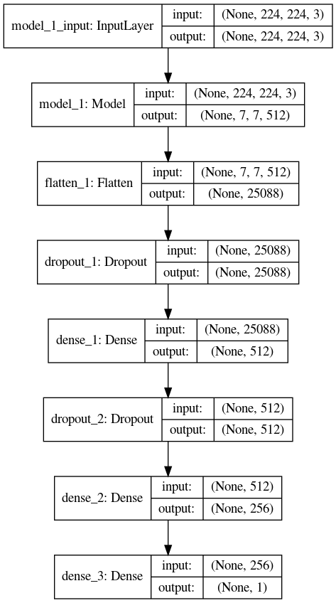

# FDA  Submission - Pneum_Rad_CAD

**Name of Device:** Pneumonia Radiography Computer Aided Detection (Pneum_Rad_CAD)

## Algorithm Description 

### 1. General Information

**Intended Use Statement:** 

Pneum_Rad_CAD is a deep learning algorithm designed to assist physicians, namely radiologists, in the automatic detection of pneumonia in chest x-rays.

**Indications for Use:**

Pneum_Rad_CAD is indicated for initial screening of patient x-rays.

Indicated media parameters include:

* Modality: Digital Radiography (X-ray)
* Body Part Examined: Chest  
* Patient Position:
  * Anterior-Posterior (AP)
  * Posterior-Anterior (PA)
 
Inidcated patient population parameters include:

* Gender: Female, Male
* Age: 2-90
    
**Device Limitations:**

*Algorithmic Limitations*:

Patient History and Demographics:  This algorithm was not specifically tested on those with a prior history of Pneumonia.  Racial or ethnic demographics are not noted in the dataset so any diffential performance in this regard is accordingly unknown. 

Patient Comorbidities:  The algorithm may tend to perform at a sub-optimal precision rate in the presence of certain comorbidities, including Cardiomegaly, Emphysema, Fibrosis, and Hernia.  The algorithm is not recommended for those known to have these comorbidities at this time.  More data needs to be gathered to better discern cases in these categories.

*Computational Limitations*:

Model training as well as testing and inference was performed utilizing an Nvidia RTX 2060 GPU with 6GB of onboard RAM. It is suggested to utilize Pneum_Rad_CAD on a system with comparable hardware.

**Clinical Impact of Performance:**

The threshold for binary classification (True/False) for incidents of pneumonia was chosen with maximum F1 score in mind, indicative of balanced performance between algorithmic recall and precision, in this case with a view towards a priority of recall (sensitivity) over precision and/or specificity.  

Pneum_Rad_CAD was tuned with a primary requirement of recall over specificity, such that, as is common for medical screening and testing, we do not miss any positive case (generating a false negative) and leave behind a patient with a potentially life-threatening condition.  The flip-side to this trade-off is that the algorithm is not as specific as it is sensitive in its positive determination and, therefore, may result in a false positive classification.  In other words, we err to the side of caution.

As the recall is high, we anticipate few false negatives, making the algorithm useful to quickly screen out patients who do not have pneumonia.  A negative test result will be a reliable indicator, allowing physician's to both screen out patients as well as prioritize workflow. 

### 2. Algorithm Design and Function

*Figure 1. Pneum_Rad_CAD Design:*

 

The algorithm will take in Digital Imaging and Communications in Medicine (DICOM) standard files as input and output a binary classification for presence of pneumonia.

**DICOM Checking Steps:**

First, we load our DICOM files and run them through a DICOM check to make sure that they are valid candidates for our algorithm with the following steps:

1. Modality should be of type "DX" indicating that it is an x-ray
2. Body Part should be "CHEST"
3. Patient Position should be "PA" or "AP"

If the file doesn't meet these criteria it is excluded, else the image is returned as a pixel array.

**Pre-processing Steps:**

Next, the image must be processed to be valid input for the algorithm with the following steps:

1.  The image is normalized from the 0-255 pixel range to 0-1 range.
2.  The image is standardardized over its range of values. 
3.  The image is resized to shape necessary for the VGG algorithm.

**CNN Architecture:**

Our model is trained via transfer learning, applying learning from image recognition and transferring it to radiology diagnosis. We will utilize the first 16 layers of VGG, the Convolutional Neural Network (CNN) which won the ImageNet 2014 challenge in the category of localization and classification.  VGG was developed by Karen Simonyan & Andrew Zisserman at the Visual Geometry Group, Department of Engineering Science, University of Oxford. See [Very Deep Convolutional Networks For Large-Scale Image Recognition'](https://arxiv.org/pdf/1409.1556.pdf).  Hence, we are utilizing image recognition feature knowledge learned from millions of images above and beyond our relatively small dataset.

* VGG Pre-Trained Layers:

        Layer (type)                 Output Shape              Param #   

        input_1 (InputLayer)         (None, 224, 224, 3)       0         

        block1_conv1 (Conv2D)        (None, 224, 224, 64)      1792      

        block1_conv2 (Conv2D)        (None, 224, 224, 64)      36928     
    
        block1_pool (MaxPooling2D)   (None, 112, 112, 64)      0       

        block2_conv1 (Conv2D)        (None, 112, 112, 128)     73856     

        block2_conv2 (Conv2D)        (None, 112, 112, 128)     147584    

        block2_pool (MaxPooling2D)   (None, 56, 56, 128)       0         

        block3_conv1 (Conv2D)        (None, 56, 56, 256)       295168  

        block3_conv2 (Conv2D)        (None, 56, 56, 256)       590080    

        block3_conv3 (Conv2D)        (None, 56, 56, 256)       590080    

        block3_pool (MaxPooling2D)   (None, 28, 28, 256)       0         

        block4_conv1 (Conv2D)        (None, 28, 28, 512)       1180160   

        block4_conv2 (Conv2D)        (None, 28, 28, 512)       2359808   

        block4_conv3 (Conv2D)        (None, 28, 28, 512)       2359808   

        block4_pool (MaxPooling2D)   (None, 14, 14, 512)       0         

        block5_conv1 (Conv2D)        (None, 14, 14, 512)       2359808   

        block5_conv2 (Conv2D)        (None, 14, 14, 512)       2359808   

        block5_conv3 (Conv2D)        (None, 14, 14, 512)       2359808   

        block5_pool (MaxPooling2D)   (None, 7, 7, 512)         0         

        Total params: 14,714,688
        Trainable params: 2,359,808
        Non-trainable params: 12,354,880

* Fine-Tuning

    * All of the layers of the VGG above were frozen except the last convolutional and pooling layer, labeled 'block5_conv3' and 'block5_pool'.  These layers were retrained along with the additional fully connected (dense) layers that we added to the model.  We also added dropout regularization layers to help the model generalize. The output layer is a single node resulting in classification probability.  This probability will be measured against a threshold for final binary classification being either positive or negative for pneumonia.

*Figure 2. Fine-Tuned Model Trainable Layers:*

 

### 3. Algorithm Training

The CNN was trained with image augmentation (utilizing the Keras pre-processing ImageDataGenerator class) to introduce variation in the training dataset.  The intention of image augmentation is to create better generalization enhancing performance overall in final classification results.

**Parameters:**

    * Types of augmentation used during training: 
        * brightness_range: 90-110%
        * height_shift_range: 10%
        * width_shift_fange: 10%
        * rotation_range: 5 degrees
        * shear_range: 10%
        * zoom_range: 10%
  
    * Batch size: 32

    * Loss: binary_crossentropy

    * Optimizer: Adam

    * Optimizer learning rate: 1e-4

    * Layers of pre-existing architecture that were frozen:

        * All of the layers of VGG were frozen except the last convolutional and pooling layer, labeled 'block5_conv3' and 'block5_pool'.

    * Layers of pre-existing architecture that were fine-tuned:

        * block5_conv3 (Conv2D)        (None, 14, 14, 512)       2359808   

        * block5_pool (MaxPooling2D)   (None, 7, 7, 512)         0   

    * Layers added to pre-existing architecture:

        * Layer (type)                 Output Shape              Param #   

        * model_1 (Model)              (None, 7, 7, 512)         14714688    [transferred from VGG]

        * flatten_1 (Flatten)          (None, 25088)             0         

        * dropout_1 (Dropout)          (None, 25088)             0         

        * dense_1 (Dense)              (None, 512)               12845568  

        * dropout_2 (Dropout)          (None, 512)               0         

        * dense_2 (Dense)              (None, 256)               131328    

        * dense_3 (Dense)              (None, 1)                 257       

        * Total params: 27,691,841
        * Trainable params: 15,336,961
        * Non-trainable params: 12,354,880

**Performance Metrics**

Metrics from our training are visualized in the following charts:

*Figure 3. History: Accuracy and Loss:*

 

*Figure 4. ROC Curve:*

 

*Figure 5. Precision-Recall Curve:*

 

**Final Threshold and Explanation:**

*Figure 6. F1 Score per Threshold:*

 

*Figure 7: Precision/Recall per Threshold:*

 

Threshold was chosen to maximize the F1 score.  At the maximum F1 score we have the following metrics:

    * AUC: 0.79
    * F1:  0.5686274509803921 
    * Threshold: 0.23956428
    * Recall: 0.90625
    * Precision: 0.4084507042253521

Recall is our priority, such to find all cases of patients with Pneumonia as well as to confidently screen out those negative for pneumonia.  The recall of our algorithm is very high given the the maximum F1 score which is as required.  Though the threshold does appear low, at this level we are given the best precision and recall balance.  As data is accumulated this could be further adjusted upwards, as F1 looks generally strong between 0.25 and 0.5.  As it stands, our AUC is relatively strong at 0.79.

We can compare our metrics with the standard given in the literature as described below in Table 1, showing both radiologist and CheXNet F1 scores:

Table 1: Radiologist Accuracy ([from CheXNet: Radiologist-Level Pneumonia Detection on Chest X-Rays with Deep Learning, Rajpurkar et al, Dec, 2017](https://arxiv.org/pdf/1711.05225.pdf))

    Radiologist         F1 Score  (95% CI)
    Radiologist 1       0.383     (0.309, 0.453)
    Radiologist 2       0.356     (0.282, 0.428)
    Radiologist 3       0.365     (0.291, 0.435)
    Radiologist 4       0.442     (0.390, 0.492)
    Radiologist Avg.    0.387     (0.330, 0.442)

    CheXNet             0.435     (0.387, 0.481)
    Pneum_Rad_CAD       0.569
 
The score is comparable, yet strong, given our limited dataset and will be thus reinforced with additional data and field study with pilot partner.

### 4. Databases

The NIH Chest X-ray Dataset was utilized in training Pneum_Rad_CAD.  The dataset information is as follows, as described by Kaggle where the dataset is stored: 

'This NIH Chest X-ray Dataset is comprised of 112,120 X-ray images with disease labels from 30,805 unique patients. To create these labels, the authors used Natural Language Processing to text-mine disease classifications from the associated radiological reports. The labels are expected to be >90% accurate and suitable for weakly-supervised learning. The original radiology reports are not publicly available but you can find more details on the labeling process in this Open Access paper: [ChestX-ray8: Hospital-scale Chest X-ray Database and Benchmarks on Weakly-Supervised Classification and Localization of Common Thorax Diseases." (Wang et al.)](https://openaccess.thecvf.com/content_cvpr_2017/papers/Wang_ChestX-ray8_Hospital-Scale_Chest_CVPR_2017_paper.pdf)'

The data has been labeled with 14 disease classes as well as a classification of 'No Finding' for a total of 15 classes.  

Findings:

1.  Atelectasis
2.  Cardiomegaly
3.  Consolidation
4.  Edema
5.  Effusion
6.  Emphysema
7.  Fibrosis
8.  Hernia
9.  Infiltration
10. Mass
11. Nodule
12. Pleural_Thickening
13. Pneumonia
14. Pneumothorax
15. No Finding

*Figure 8. Sample image for each type of finding:* 

*Figure 9. Pixel intensity distribution of each sample image:*

   
**Splitting the Dataset**

The data was cleaned for appropriate age (excluding any erroneous values over 100) and randomly split on the target label pneumonia.  We ensured there is no patient overlap between the training and validation set that could lead to data leakage.  Only ~1.28% of the data was labeled with pneumonia so our resulting datasets are very small in order to maintain a 50/50 balance  of positive/negative cases in the training set and a 20/80 respective balance in the validation set. 
    
**Description of Training Dataset:**

The training set consisted of 2288 images, with a 50/50 split of 1144 labeled positive for pneumonia and 1144 negative.

**Description of Validation Dataset:** 

The training set consisted of 810 images, with a 20/80 split of 162 labeled positive for pneumonia and 648 negative.

### 5. Ground Truth 

The researchers (Wang et al) compiled the dataset by mining their Picture Archiving and Communication Systems (PACS) and performed text mining on associated radiological reports using various NLP techniques.  As stated above, labels are expected to be ~90% accurate.  There is room for error given various radiologist's summation as well as error in various NLP techniques.  As well, error may be confounded as patients may or may not be correctly labeled with muliple diagnoses.

### 6. FDA Validation Plan

**Patient Population Description for FDA Validation Dataset:**

Patient validation data should come from patients age 2-90, insignificant of gender or race (i.e, distribution reflective of general population), with no prior known history of Pneumonia.

The data should come from screening studies comprising either Posterior-Anterior (PA) or Anterior-Posterior (AP) views.

**Ground Truth Acquisition Methodology:**

As the intended use of the Pneumo_Rad_CAD is to assist radiologists in idenitifying pneumonia, serving as a screening device, we will be looking for a silver standard (radiologist labeling) rather than a gold standard as to the ground truth of pneumonia (culture and biopsy). It would be preferable to create a silver standard by weighting performance of multiple radiologists of various experience levels.

**Algorithm Performance Standard:**

Per the 'Radiologist Accuracy' data referred to above ([from CheXNet: Radiologist-Level Pneumonia Detection on Chest X-Rays with Deep Learning, Rajpurkar et al, Dec, 2017](https://arxiv.org/pdf/1711.05225.pdf)), individual radiologist F1 scores ranged from 0.356 to 0.442, averaging 0.387.  The comparable algorithm, CheXNet, performed at an F1 level of 0.435, nearly meeting performance of the best radiologist score.  Our current stats indicate a recall/sensitive  of >.90, AUC of 0.79, and F1 score of .57. Our aim in performance metric is to maintain a recall/sensitivity of >.90 while maintaining highest AUC and F1, at least meeting the radiologist average F1 score of 0.387. 

